# Care Fund – README & Architecture

## 1. Project Setup

```bash
# Install deps
npm install

# Run dev server
npm run dev

# Build for production
npm run build

# Preview production build
npm run preview
```

Environment:

```env
VITE_OPENAI_API_KEY==sk-xxxx   # optional, for AI Assist
VITE_OPENAI_MODEL=gpt-4o-mini # default fallback model
```

Without a key, AI features fall back to safe offline behavior.

---

## 2. Architecture Overview

```text
src/
  components/
    ApplicationForm.tsx        # Multi-step form shell (re-exported feature component)
    Header.tsx                 # App header + language switch
    steps/                     # Step-specific inputs
    ui/                        # Local shadcn/ui primitives
  features/
    application/               # Stepper hook, form constants, utilities
    assist/                    # AI Assist prompts, dialog, services
  contexts/                    # Global providers (Language, etc.)
  hooks/                       # Shared hooks (drafts, translations, toasts)
  lib/                         # API client, validation helpers, misc utils
  pages/                       # Route-level screens (Index, Application, Submissions)
  constants/                   # Routes, form config, enums, labels
  styles/                      # Tailwind configuration and global CSS
  App.tsx / main.tsx           # Router + providers bootstrap
  vite.config.ts               # Vite configuration
```

---

## 3. Key Concepts

### Multi-step Form

- Step 1: Personal info
- Step 2: Family & financial details
- Step 3: Situation description (AI Assist + translation)
- Zod schemas gate each step and the full payload before submission.

### i18n & RTL

- `LanguageContext` manages the locale (`en` / `ar`) and direction.
- Layout flips automatically; labels and placeholders re-render instantly.

### AI Assist

- `features/assist/services/aiAssist.ts` wraps OpenAI Chat Completions.
- Offline templates guarantee deterministic copy when no API key exists.
- Prompt builders support both generate and refine flows.

### Validation & Persistence

- Shared zod schemas enforce constraints.
- Drafts live in `localStorage` so users can resume work.
- Submissions listing reads/writes from the same storage key.

---

## 5. Development Guidelines

- **Types first** - extend the shared types module before wiring new data.
- **Validation** - every new field belongs in the zod schemas.
- **Translations** - always add both `en` and `ar` entries.
- **UI** - prefer `components/ui` primitives for consistent styling.

---

## 6. Troubleshooting

- **Form shows errors immediately?** Ensure translation hooks do not trigger validation.
- **Arabic not detected?** Double-check language helpers in `constants/lang.ts`.
- **AI Assist fails?** Verify `VITE_OPENAI_API_KEY` or rely on the offline fallback.

## 7. Future Improvements

- Add tests for auto-translation and AI Assist.
- Export/import submissions (JSON).
- Multi-user profiles.

## Screenshots

<details>
  <summary><strong>Open gallery (1-14)</strong></summary>

  <p align="center">
    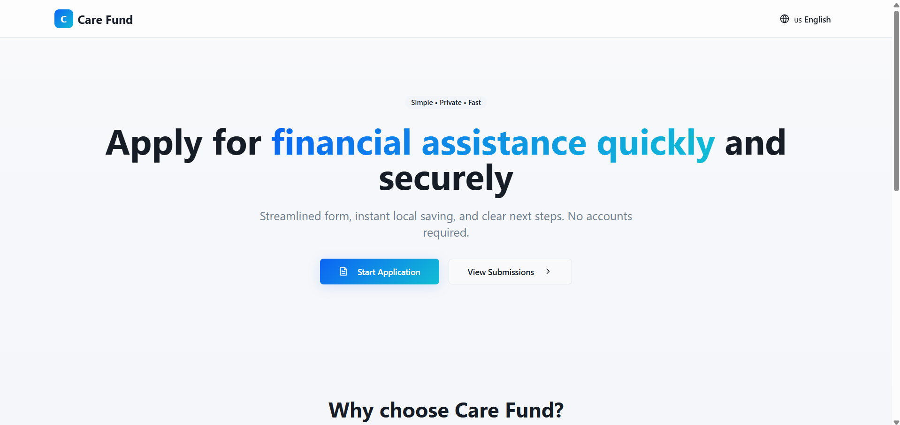
    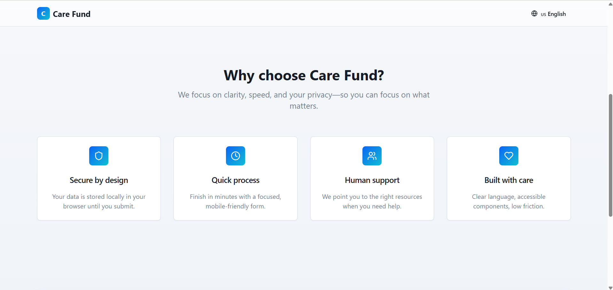
    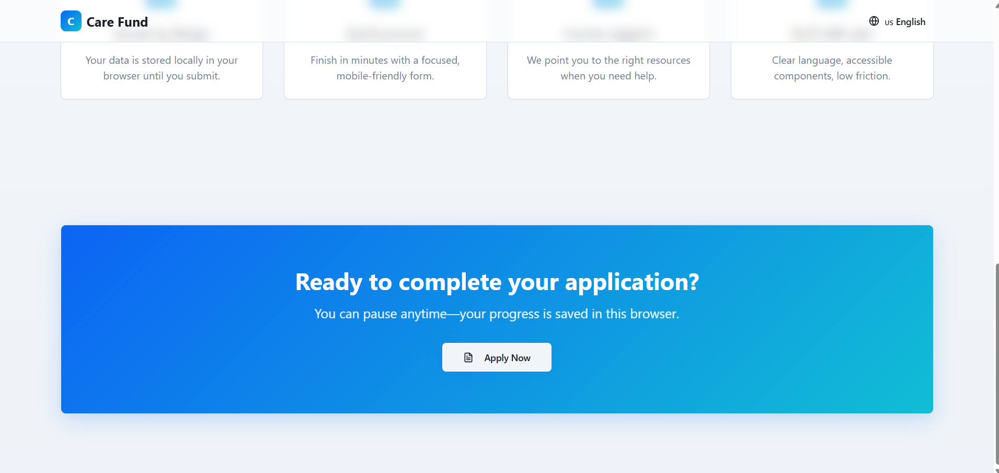
    
  </p>
  <p align="center">
    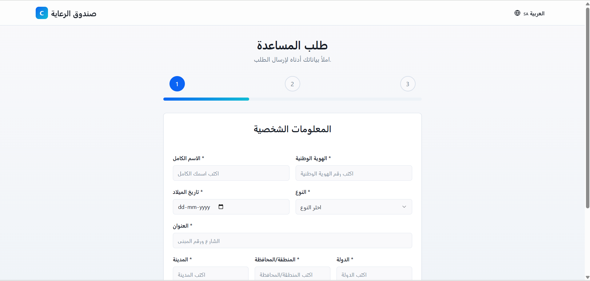
    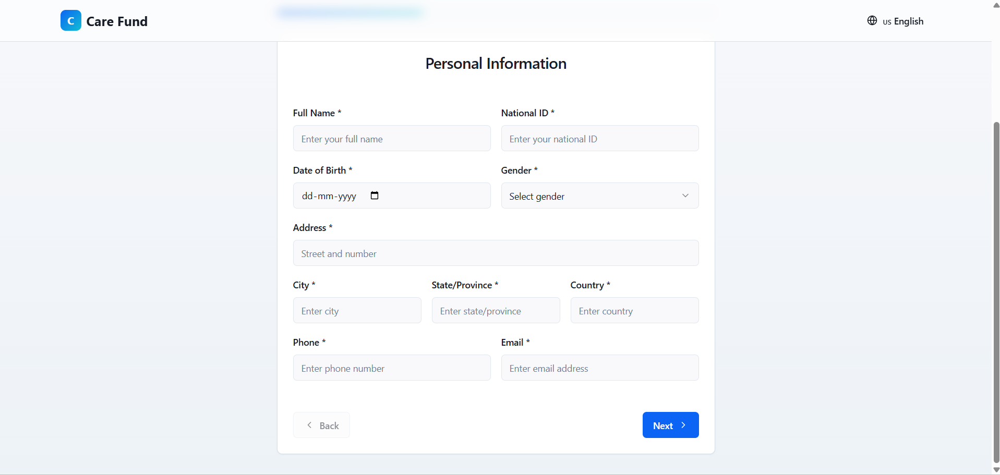
    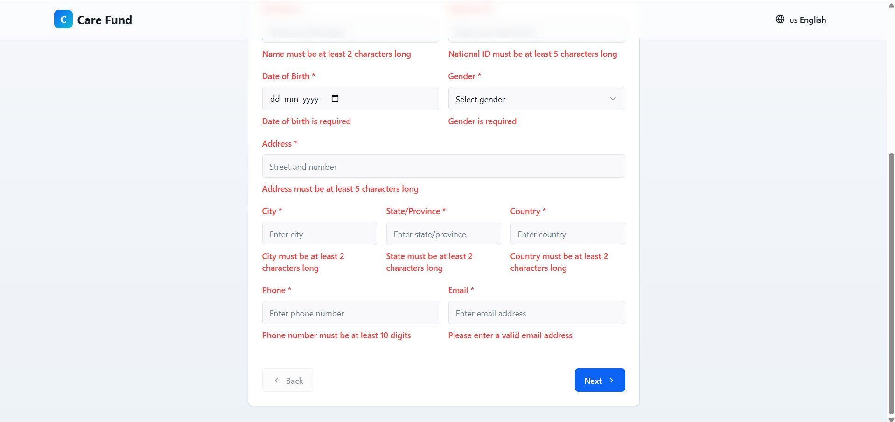
    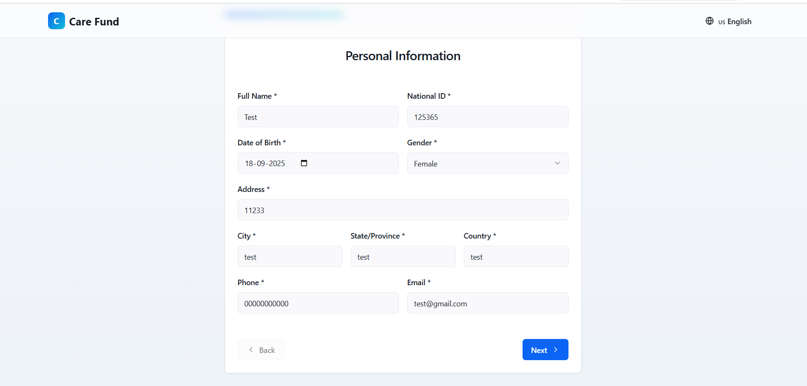
  </p>
  <p align="center">
    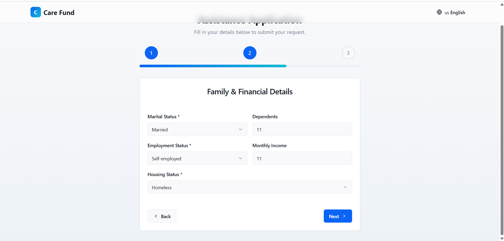
    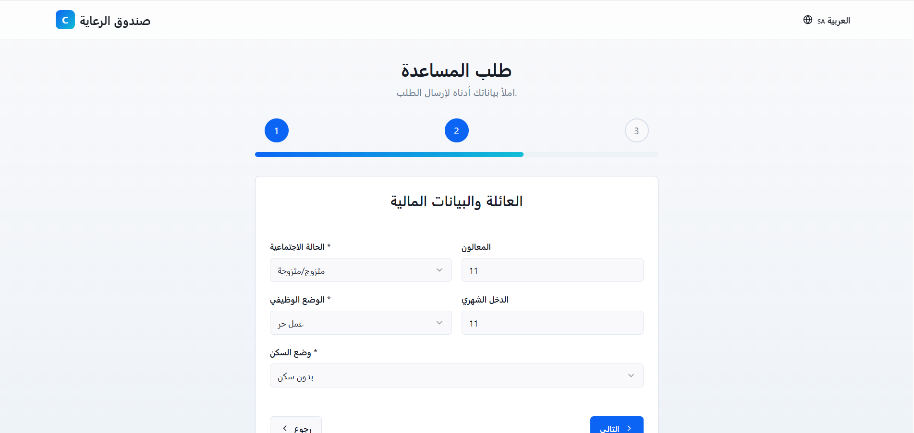
    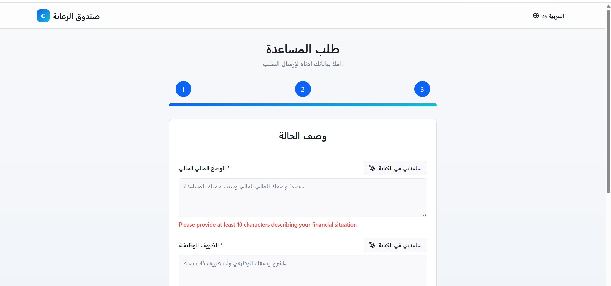
    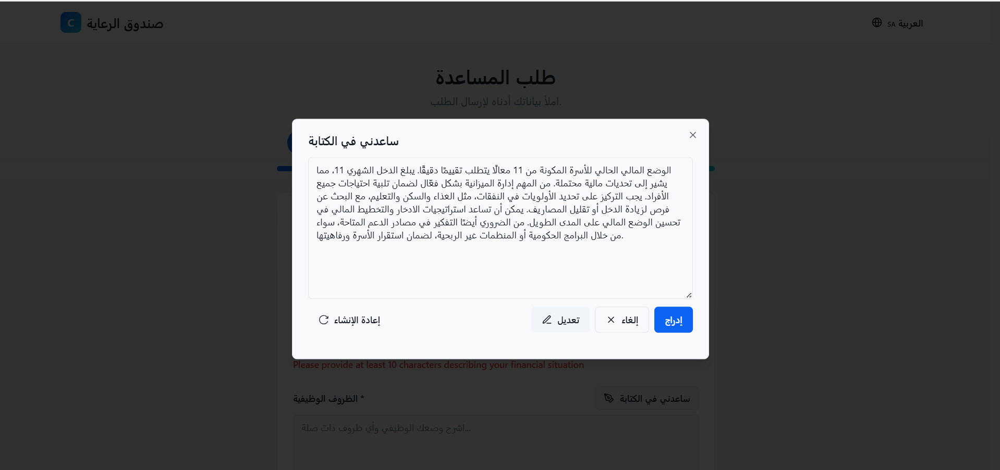
  </p>
  <p align="center">
    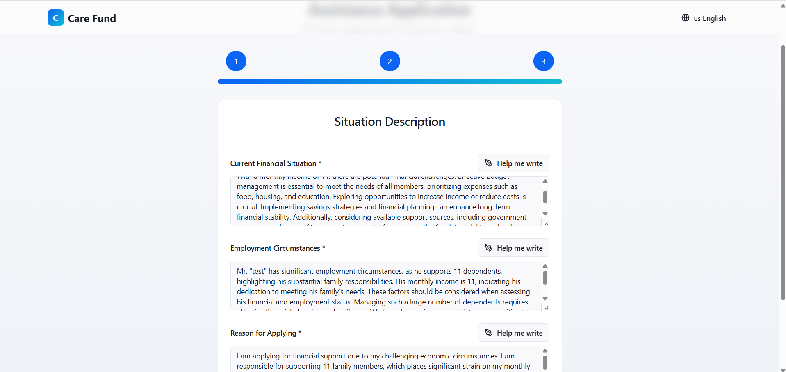
    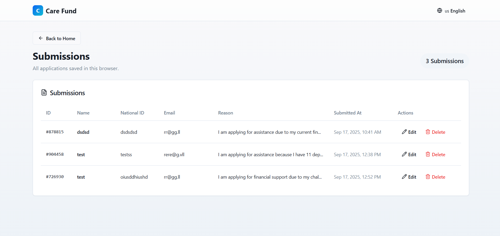
  </p>
</details>
