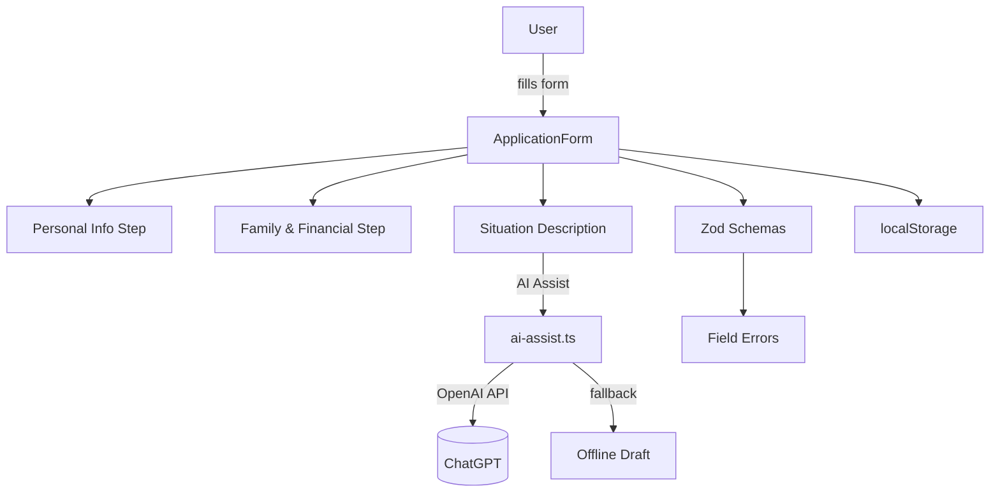

# Care Fund – README & Architecture

## 1. Project Setup

```bash
# Install deps
npm install

# Run dev server
npm run dev

# Build for production
npm run build

# Preview production build
npm run preview
```

Environment:

```env
VITE_OPENAI_API_KEY==sk-xxxx   # optional, for AI Assist
VITE_OPENAI_MODEL=gpt-4o-mini # default fallback model
```

Without a key, AI features fall back to safe offline behavior.

---

## 2. Architecture Overview

```text
src/
├─ components/
│  ├─ application-form.tsx          # Multi-step form (Stepper, validation, navigation)
│  ├─ header.tsx                    # App header + language switch
│  ├─ steps/
│  │  ├─ personal-info-step.tsx     # Step 1: personal fields + auto-translate on lang toggle
│  │  ├─ family-financial-step.tsx  # Step 2: family/financial fields
│  │  └─ situation-description-step.tsx # Step 3: textareas + AI Assist + error gating
│  └─ ui/                           # Shadcn UI primitives (typed, local)
│
├─ contexts/
│  └─ language-context.tsx          # Global language state ("en" | "ar"), RTL/LTR direction
│
├─ i18n/
│  └─ translations.ts               # English/Arabic translation dictionaries
│
├─ lib/
│  ├─ text-direction.ts              # RTL/LTR helpers
│  ├─ utils.ts                       # Shared helpers
│  └─ validations.ts                 # zod schemas (per-step + full form)
│
├─ pages/
│  ├─ Index.tsx                     # Landing page
│  ├─ Application.tsx               # Main form page (persist state)
│  └─ Submissions.tsx               # Saved submissions (localStorage)
│
├─ services/
│  └─ ai-assist.ts                  # OpenAI API chat + offline fallback & translators
│
├─ types/
│  └─ types.ts                      # Shared types (ApplicationState, AssistFieldKey, Lang)
│
├─ App.tsx / main.tsx               # Router + Providers (QueryClient, Tooltip, Language)
├─ index.css / App.css              # Tailwind base + custom styles
└─ vite.config.ts                   # Vite config
```

---

## 3. Key Concepts

### 📝 Multi-step Form

- Step 1: Personal Info
- Step 2: Family & Financial Info
- Step 3: Situation Description (AI Assist + auto-translation)
- Step validation is schema-driven (zod).

### 🌐 i18n & RTL

- `language-context.tsx` manages language (`en` / `ar`).
- Text direction auto-switches (LTR/RTL).
- Placeholders + labels update instantly.

### 🤖 AI Assist

- `ai-assist.ts` calls OpenAI Chat Completions API.
- If no API key → offline template-based fallback.
- Supports refine vs generate prompts.
- Integrated via `AiAssist` button in Step 3.

### ✅ Validation

- Step-level schemas in `validations.ts`.
- Errors only show if field touched or after submit attempt.

### 💾 Persistence

- Submissions stored in localStorage.
- Can be listed on `Submissions.tsx`.

---

## 4. Data Flow Diagram (Mermaid)



---

## 5. Development Guidelines

- **Types first** → always extend `types.ts`.
- **Validation** → all new fields require zod schema.
- **Translations** → add both `en` and `ar` entries.
- **UI** → prefer `ui/` primitives, follow Tailwind design.

---

## 6. Troubleshooting

- **Form shows errors immediately?** → ensure `shouldValidate` is `false` in auto-translations.
- **Arabic not detected?** → check regex in `isArabic()`.
- **AI Assist fails?** → verify `REACT_APP_OPENAI_API_KEY`.

---

## 7. Future Improvements

- Add tests for auto-translation and AI Assist.
- Export/import submissions (JSON).
- Multi-user profiles.

## 📸 Screenshots

<details>
  <summary><strong>Open gallery (1–14)</strong></summary>

  <p align="center">
    
    
    
    
  </p>
  <p align="center">
    
    
    
    
  </p>
  <p align="center">
    
    
    
    
  </p>
  <p align="center">
    
    
  </p>
</details>
